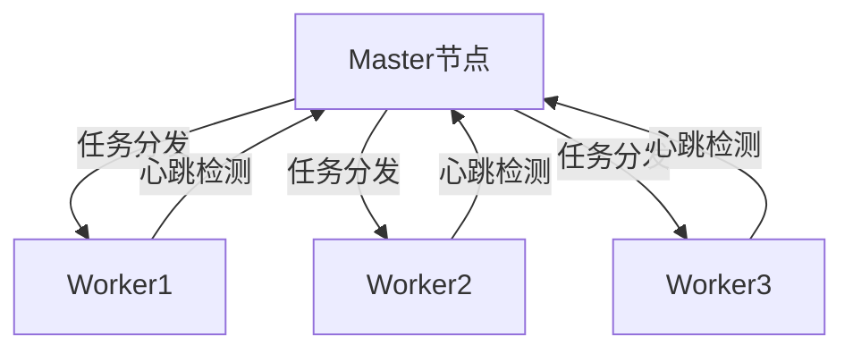

# 企业合作方案

TaskPyro 为企业和开发者团队提供专业的定制化解决方案，助力构建高效的自动化调度体系。

## 项目定制开发

根据企业需求提供完整的Python自动化解决方案：

- 爬虫系统定制开发
- 数据处理流水线构建
- 自动化测试平台开发
- 企业级任务调度中台

## 分布式调度系统

构建高可用分布式任务调度集群：

### 核心特性
- 支持横向扩展的分布式架构
- 智能负载均衡算法
- 故障自动转移机制
- 多数据中心部署支持

## 跨平台调度方案

实现Linux/Windows混合环境调度：

### 主从式架构
- Linux主节点负责任务调度
- Windows从节点执行任务
- 双向心跳检测机制
- 跨平台文件同步方案

## 管理平台定制

基于Django+Vue3打造企业级管理系统：

> 项目源码：https://github.com/taskPyroer/DjangoVue3Admin

### 功能模块
1. 权限管理系统
   - RBAC角色权限控制
   - 操作日志审计
   - 多租户支持

2. 可视化监控看板
   - 实时任务状态监控
   - 资源使用热力图
   - 自定义报表生成

3. OpenAPI对接
   - Swagger文档支持
   - JWT认证机制
   - Webhook事件通知

## 合作流程

1. 需求沟通与分析
2. 方案设计与报价
3. 签订保密协议
4. 项目开发与测试
5. 部署与验收
6. 持续运维支持

欢迎通过 微信PJ221BBB 联系我本人。