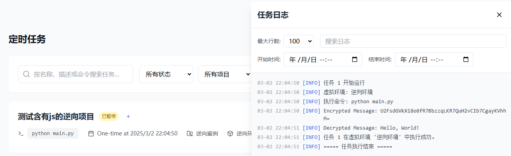

## Scrapy 爬虫样例

以下是一个使用 Scrapy 框架的基础爬虫项目示例：

### 项目结构

```
quotes_spider/
├── scrapy.cfg            # 项目配置文件
└── quotes_spider/
    ├── __init__.py
    ├── items.py          # 项目数据模型
    ├── middlewares.py    # 项目中间件
    ├── pipelines.py      # 数据处理管道
    ├── settings.py       # 项目设置
    └── spiders/         # 爬虫目录
        ├── __init__.py
        └── quotes.py    # 爬虫文件
```

### 爬虫代码

```python
import scrapy


class QuotesSpider(scrapy.Spider):
    # 爬虫的名称，必须唯一
    name = "quotes"
    # 起始 URL 列表，爬虫将从这些 URL 开始爬取
    start_urls = [
        'https://quotes.toscrape.com',
    ]

    def parse(self, response):
        # 遍历每个名言元素
        for quote in response.css('div.quote'):
            # 提取名言文本
            text = quote.css('span.text::text').get()
            # 提取作者姓名
            author = quote.css('small.author::text').get()
            # 提取标签列表
            tags = quote.css('div.tags a.tag::text').getall()

            # 生成包含提取信息的字典，并通过 yield 返回
            yield {
                'text': text,
                'author': author,
                'tags': tags
            }

        # 查找下一页的链接
        next_page = response.css('li.next a::attr(href)').get()
        if next_page is not None:
            # 如果存在下一页链接，使用 response.follow 方法继续爬取下一页，并调用 parse 方法处理响应
            yield response.follow(next_page, self.parse)
```

### 在 TaskPyro 中配置运行

1. **配置 Python 虚拟环境**
   - 在 TaskPyro 的「Python环境管理」页面创建新的虚拟环境
   

2. **上传爬虫项目**
   - 在 TaskPyro 的「项目管理」页面创建新项目
   - 将完整的 Scrapy 项目文件上传到项目目录中
   - 确保项目结构完整，包含所有必要的配置文件

3. **创建爬虫任务**
   - 在「任务管理」页面创建新任务
   - 选择已配置的 Python 虚拟环境
   - 设置运行命令：
     ```bash
     scrapy crawl quotes -o quotes.json
     ```
   - 配置任务调度方式

4. **运行效果**
   - 任务启动后，爬虫将自动爬取网站内容
   - 数据将保存到 quotes.json 文件中
   - 可在任务日志中查看爬取进度和结果

## Selenium 自动化样例

使用 Selenium 进行网页自动化操作的示例：

::: warning 注意
以下配置选项在 TaskPyro 环境中是必须的：
- `--no-sandbox`：禁用沙箱模式，解决容器环境下的权限问题
- `--headless`：无界面模式运行，服务器环境必需
- `--disable-gpu`：禁用 GPU 加速，避免服务器环境相关问题
- `--disable-software-rasterizer`：禁用软件光栅化，提高稳定性
- `--disable-dev-shm-usage`：避免 Linux 系统共享内存不足问题
:::

```python
from selenium import webdriver
from selenium.webdriver.chrome.service import Service
import os

service = Service()
options = webdriver.ChromeOptions()
options.add_argument('--no-sandbox')
options.add_argument('--headless')
options.add_argument('--disable-gpu')
options.add_argument('--disable-software-rasterizer')
options.add_argument('--disable-dev-shm-usage')

driver = webdriver.Chrome(service=service, options=options)

try:
    driver.get('https://www.bilibili.com')
    title = driver.title
    print(f"B 站网站的标题是: {title}")
except Exception as e:
    print(f"发生错误: {e}")
finally:
    driver.quit()
```

## Playwright 自动化样例

::: warning 注意
在使用 Playwright 时，请注意以下重要事项：
- 首次在新环境中运行 Playwright 时，必须先安装 Chromium 浏览器
- 系统重启或更新后，也需要重新执行一次安装命令
- 在代码执行安装安装命令：`playwright install chromium`，如下代码示例
:::

使用 Playwright 进行现代网页自动化的示例：

```python
mport asyncio
from playwright.async_api import async_playwright
import subprocess

# 安装 Chromium，第一次在playwright环境下运行，需要先安装如下命令，否则会有异常警告，安装完之后，下次运行则不需要再次执行了
# subprocess.run(["playwright", "install", "chromium"], check=True)

async def main():
    async with async_playwright() as p:
        # 启动 Chromium 浏览器
        browser = await p.chromium.launch(headless=True)
        # 创建一个新的浏览器上下文
        context = await browser.new_context()
        # 在上下文中创建一个新的页面
        page = await context.new_page()

        try:
            # 打开百度首页
            await page.goto('http://www.bilibili.com/')

            # 获取搜索结果页面的标题
            title = await page.title()
            print(f"搜索结果页面的标题是: {title}")

        except Exception as e:
            print(f"发生错误: {e}")
        finally:
            # 关闭浏览器
            await browser.close()


if __name__ == "__main__":
    asyncio.run(main())
```

## DrissionPage 自动化样例

使用 DrissionPage 进行网页自动化的示例：

```python
from DrissionPage import ChromiumOptions, ChromiumPage

try:
    co = ChromiumOptions().auto_port()
    co.set_argument('--no-sandbox')
    co.set_argument('--headless=new')
    co.set_argument('--single-process')  # 单进程模式
    co.set_argument('--disable-gpu')  # 禁用GPU加速
    page = ChromiumPage(co)
    page.get('about:blank')
    page.get('http://www.bilibili.com/')
    title = page.title
    print(title)
    page.close()
    page.quit()
finally:
    if 'page' in locals():
        page.quit()
```

<!-- # 运行效果

以下是各个框架运行时的效果截图：

## Scrapy 爬虫运行效果 -->
<!--  -->

<!-- ## Selenium 自动化效果 -->
<!--  -->

<!-- ## Playwright 自动化效果 -->
<!--  -->

<!-- ## DrissionPage 自动化效果 -->
<!--  -->

## JS逆向示例

在爬虫开发中，经常需要处理一些经过JS加密的数据。以下是一个简单的JS逆向示例，展示如何在Python中调用Node.js实现的加密解密功能：

### 项目结构

```
js_reverse_demo/
├── decrypt-v.js         # JS加密解密实现
├── main.py             # Python调用示例
├── package.json        # Node.js项目配置
├── package-lock.json   # 依赖版本锁定
└── node_modules/       # Node.js依赖包
    └── crypto-js/      # AES加密库
```

### JS加密解密实现

```javascript
// decrypt-v.js
const CryptoJS = require('crypto-js');

function encryptMessage(message, secretKey) {
    return CryptoJS.AES.encrypt(message, secretKey).toString();
}

function decryptMessage(encryptedMessage, secretKey) {
    const bytes = CryptoJS.AES.decrypt(encryptedMessage, secretKey);
    return bytes.toString(CryptoJS.enc.Utf8);
}
```

### Python调用示例

```python
# main.py
import execjs

with open('decrypt-v.js', 'r') as f:
    jscontent = f.read()
context= execjs.compile(jscontent)


# 调用加密和解密函数
encrypted_message = context.call('encryptMessage', 'Hello, World!', 'secret-key')
print(f"Encrypted Message: {encrypted_message}")

decrypted_message = context.call('decryptMessage', encrypted_message, 'secret-key')
print(f"Decrypted Message: {decrypted_message}")
```

### 运行效果



### 在 TaskPyro 中配置运行

1. **本地环境准备**
   - 确保本地已安装 Node.js
   - 在项目目录下运行 `npm install xxx` 安装依赖
   - 确认 node_modules 目录已生成

2. **上传项目**
   - 在 TaskPyro 的「项目管理」页面创建新项目
   - 将完整项目目录（包含 node_modules）上传到平台
   - 确保所有文件结构完整

3. **创建任务**
   - 在「任务管理」页面创建新任务
   - 选择 Python 环境
   - 设置运行命令：`python main.py`
   - 配置任务调度方式

4. **运行效果**
   - 任务启动后会自动执行加密解密测试
   - 可在任务日志中查看运行结果
   - 输出包含原文、密文和解密后的文本
