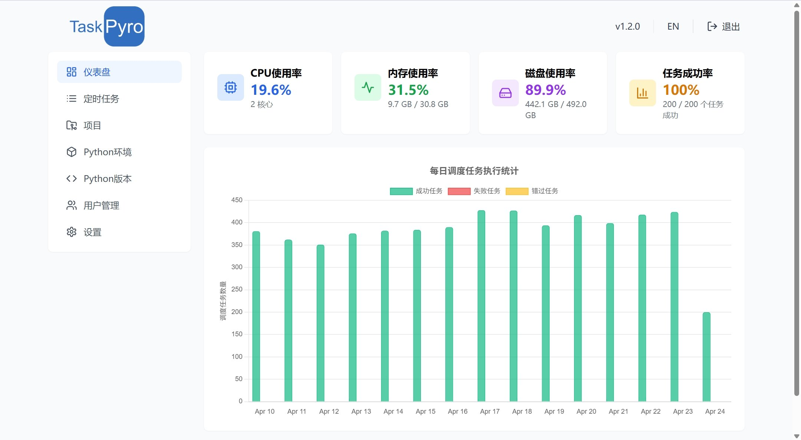

# 系统资源监控

仪表盘提供了实时的系统资源使用情况监控，帮助您及时了解系统的运行状态。

## CPU使用率

显示当前系统的CPU使用百分比，以及最近的CPU负载情况。
## 内存使用率

展示系统内存的使用情况，包括：
- 已使用内存/总内存
- 使用率百分比

例如：11.9 GB / 15.8 GB，使用率75.1%

## 磁盘使用率

监控系统磁盘存储空间的使用情况：
- 已使用空间/总空间
- 使用率百分比

例如：57.8 GB / 341.2 GB，使用率16.9%

# 任务执行统计

## 任务成功率

展示系统中任务的整体执行情况：
- 成功任务数/总任务数
- 成功率百分比

例如：16/18个任务成功，成功率89%

## 每日任务执行统计

通过图表形式展示每日任务执行的详细统计：
- 成功任务：显示绿色
- 失败任务：显示红色
- 错过任务：显示黄色

图表可以直观地展示任务执行的趋势和分布情况，帮助您更好地了解系统运行状况。
