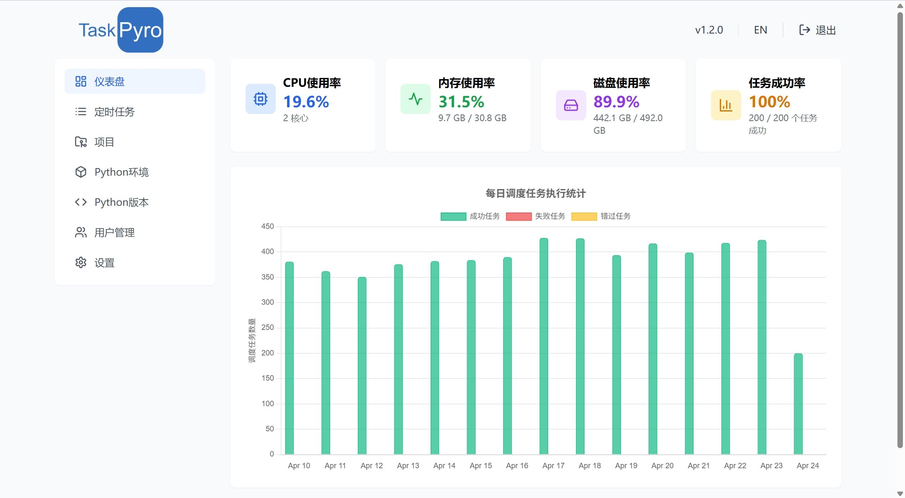

## TaskPyro 是什么？

TaskPyro 是一个轻量级的 Python 任务调度平台，专注于提供简单易用的任务管理和爬虫调度解决方案。它能够帮助您轻松管理和调度 Python 任务，特别适合需要定时执行的爬虫任务和数据处理任务。

## 开发背景

在当今数字化时代，自动化数据采集和处理变得越来越重要。然而，现有的任务调度解决方案要么过于复杂，要么缺乏针对 Python 环境的特定优化。TaskPyro 正是为了解决这些痛点而诞生的，旨在为 Python 开发者提供一个简单、高效、可靠的任务调度平台。

## 适用人群

TaskPyro 特别适合以下用户群体：

- 🔍 **数据工程师**：需要定期执行数据采集、清洗和处理任务
- 🕷️ **爬虫开发者**：需要管理和调度多个爬虫任务
- 📊 **数据分析师**：需要自动化数据分析流程
- 🛠️ **系统运维人员**：需要执行定时系统维护任务
- 🚀 **创业团队**：需要一个轻量级但功能完整的任务调度解决方案

## 使用流程
- 配置Python环境和版本
- 创建项目
- 配置消息通知
- 创建定时任务

## 核心功能

TaskPyro 提供了一系列强大的功能，帮助您高效管理 Python 任务：

- 📅 **灵活的任务调度**
  - 支持 Cron 表达式定时调度
  - 支持固定间隔调度
  - 支持一次性任务执行
  - 支持任务依赖关系配置

- 🔧 **Python 环境管理**
  - 支持多个 Python 虚拟环境
  - 环境隔离，避免依赖冲突
  - 支持 pip 包管理
  - 支持官网资源包自动解压安装
  - 内置Python版本管理工具

- 🕷️ **爬虫框架支持**
  - 支持 Scrapy等主流爬虫框架
  - 支持 Selenium、Playwright、DrissionPage 等浏览器自动化工具
  - 提供完整的框架运行环境配置
  - 内置 Node.js 环境，支持 JS 逆向
  - 支持 PyExecJS 等常用逆向库
  - 支持 Python 与 JS 代码无缝集成

- 📊 **任务监控与管理**
  - 实时任务状态监控
  - 详细的执行日志记录
  - 任务执行统计分析
  - 支持钉钉、飞书、企业微信通知
  - 异常告警和执行结果推送

- 💼 **用户友好**
  - 直观的 Web 操作界面
  - 详细的使用文档
  - 简单的部署流程
  - 完善的错误处理机制
  - 支持多用户管理和权限控制

