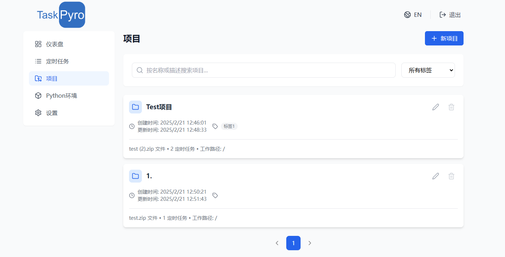

## 项目管理功能

TaskPyro 提供了直观的项目管理界面，支持添加和编辑项目。本文将详细介绍项目管理的各项功能。

## 查看项目列表

在项目管理界面，您可以查看已创建的项目列表。每个项目都包含以下信息：

## 添加/编辑项目

在项目管理界面，您可以通过点击"新建项目"按钮来创建新项目。新建项目界面如下：

以下是各个字段的详细说明：

### 项目名称

- 为您的项目设置一个唯一的名称
- 建议包含版本信息，便于管理

### 工作路径

工作路径是项目文件的执行路径，系统会根据上传的ZIP文件结构自动推荐合适的工作路径：

- 单文件情况：如果ZIP解压后只有一个Python文件，工作路径默认设置为 `/`
- 文件夹情况：如果ZIP解压后包含项目文件夹（如 `Demo` 文件夹），且Python文件位于该文件夹中，则工作路径会设置为 `/Demo`，即工作路径为项目文件夹名称
- GIT仓库情况：如果选择Git仓库方式导入项目，工作路径默认设置为 `/`

::: tip 提示
正确设置工作路径对项目的执行至关重要，它决定了Python文件的相对导入路径。
:::

### 项目描述

- 可以添加项目的详细说明
- 支持描述项目的功能、用途、注意事项等信息

### 项目标签

- 支持为项目添加多个标签
- 标签可用于项目分类和快速筛选
- 在输入框中输入标签名称，点击"添加"按钮即可创建新标签

### 项目来源

您可以通过以下两种方式导入项目代码：

#### ZIP上传

- 支持上传ZIP格式的压缩文件
- ZIP文件应包含完整的项目代码和相关资源
- 可以通过拖拽或点击选择文件的方式上传

::: warning 注意
请确保ZIP文件的组织结构合理，便于系统正确识别工作路径。
:::

#### Git仓库

- 支持从Git仓库拉取代码
- 需要提供完整的Git仓库地址（HTTPS格式）
- 可以选择指定的分支（默认为main分支）
- 支持私有仓库认证（可选填写用户名和密码）

::: tip 提示
使用Git仓库方式可以更方便地管理和更新项目代码。建议使用HTTPS格式的仓库地址，如：https://github.com/username/repository.git
:::

## 使用建议

1. 项目命名建议包含版本信息，便于版本管理
2. 合理使用标签系统，便于项目分类和检索
3. 在上传ZIP文件前，建议检查项目结构的合理性
4. 确保工作路径设置正确，避免执行时出现导入错误
