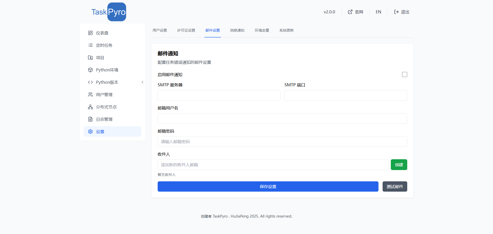

# 设置

## 用户设置

在用户设置页面，您可以管理您的账户设置并修改密码。系统默认的管理员账户信息如下：

- 用户名：admin
- 默认密码：admin123

为了系统安全，建议您在首次登录后立即修改默认密码。修改密码时，需要输入当前密码和新密码，并确认新密码。

## 许可证设置

许可证设置页面显示了您当前的许可证状态和使用限制。免费版用户可以使用以下功能：

- 创建最多 5 个定时任务
- 创建最多 2 个项目
- 创建最多 2 个虚拟环境

如需突破以上限制，您可以[购买许可证](../price/README.md)以获得无限制使用权限。点击"激活"按钮，输入有效的许可证密钥即可激活高级功能。如需购买许可证，请订阅。

## 邮件设置

专业版邮件设置提供了全面的邮件通知功能，支持多种通知场景和灵活的通知规则配置。

### 邮件服务配置

#### SMTP服务器设置

配置邮件通知需要设置以下基本信息：

邮件设置功能允许您配置系统的邮件通知功能。当启用邮件通知后，系统会在定时任务执行出错时自动发送警报邮件。

配置邮件通知需要设置以下信息：

1. SMTP服务器地址
2. SMTP端口
3. 邮箱用户名
4. 邮箱密码
5. 启用通知
完成上面配置后，点击保存按钮即可。

#### 信息通知功能

1. **第三方集成**
   - 钉钉机器人
   - 企业微信
   - 飞书

