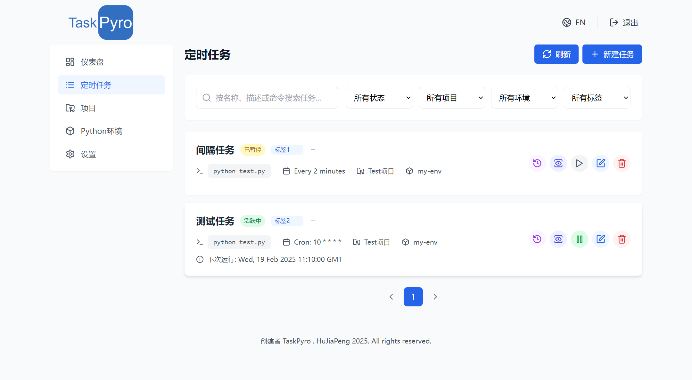

# 任务管理

TaskPyro提供了强大而灵活的任务管理功能，让您能够轻松创建和管理Python脚本的定时任务。

## 创建任务

在TaskPyro中创建新任务时，您可以：

1. 为任务指定一个描述性的名称
2. 选择已创建的项目和对应的Python虚拟环境
3. 设置要执行的Python脚本命令（例如：`python script.py` 或 `cd conf/aaa && python 1.py`等任意组合命令行）
4. 配置任务的调度方式

## 调度类型

TaskPyro支持多种调度类型，以满足不同的任务执行需求：

### 立即执行

不需要时间调度，立即执行一次任务。

### 间隔执行

按照固定的时间间隔重复执行任务。您可以设置：
- 间隔时长（支持秒、分钟、小时、天等单位）
- 首次执行时间

### 一次性执行

在指定的日期和时间执行一次任务。

### Cron表达式

使用标准的Cron表达式来定义复杂的执行计划，支持：
- 分钟级别的精确控制
- 每天、每周、每月的定时执行
- 复杂的组合调度规则

## 任务列表

TaskPyro的主界面提供了丰富的任务调度信息和操作功能：

### 基本信息
- 任务名称和描述
- 所属项目和Python虚拟环境
- 执行命令和参数
- 下次执行时间
- 任务状态（活跃中、暂停、错误）

### 任务操作
- 暂停/启动调度任务
- 强制终止正在运行的任务实例
- 编辑任务配置
- 添加/编辑任务标签，方便分类管理

## 执行历史

每个任务都有详细的执行历史记录，您可以查看：

- 历次执行的开始和结束时间
- 任务执行状态（成功/失败）
- 执行耗时统计
- 错误信息（如果执行失败）

## 运行日志

TaskPyro提供了强大的日志查看功能：

### 日志筛选
- 按时间范围筛选
- 支持关键词搜索
- 按日志级别过滤（INFO、ERROR等）

### 实时查看
- 自动刷新最新日志
- 支持暂停自动刷新
- 可查看历史日志记录

## 并发实例管理

TaskPyro提供了灵活的并发实例管理功能：

1. 默认情况下，如果上一个任务实例还在运行，新的调度时间到达时将跳过执行
2. 通过设置最大并发实例数，可以允许同一个任务的多个实例同时运行
3. 适用场景示例：
   - 任务执行时间为1分钟
   - 调度间隔为30秒
   - 设置并发实例后，新的任务实例将在下一个时间点启动，不需要等待上一个实例完成
   - 不设置并发实例时，将等待上一个实例完成后，在下一个调度点执行

## 任务编辑

您可以随时编辑已创建的任务：
- 修改任务名称和描述
- 更新Python环境配置
- 调整调度设置
- 启用/禁用并发实例
- 管理任务标签

通过这些功能，TaskPyro为您提供了一个完整的Python任务调度解决方案，帮助您高效管理自动化任务。

