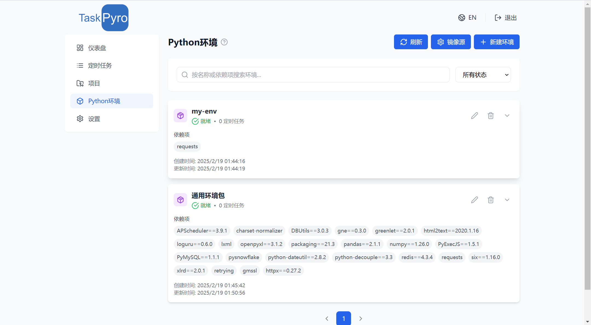
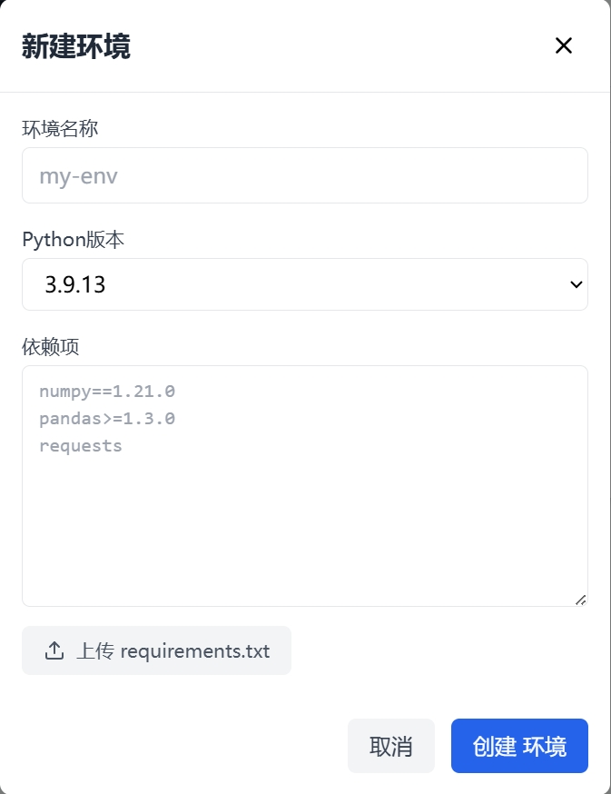

# Python虚拟环境管理

TaskPyro提供了强大而灵活的Python虚拟环境管理功能，支持多个Python版本，默认使用Python 3.9.21版本。通过直观的Web界面，您可以轻松创建、编辑和管理虚拟环境，为您的任务提供独立的运行环境。

## 核心特性

### 1. 环境复用与管理

- 🔄 **一对多关系**：一个虚拟环境可以同时服务于多个定时任务，提高资源利用效率
- ⚙️ **灵活配置**：支持自定义环境名称和依赖包，满足不同任务的需求
- 🐍 **版本选择**：支持选择不同的Python版本，适应各种项目需求

### 2. 实时安装日志

- 📝 **详细记录**：完整记录包安装过程，包括下载进度、依赖解析等信息
- 🔍 **错误追踪**：清晰显示安装过程中的警告和错误信息，便于问题排查
- ⚡ **实时反馈**：安装过程实时展示，无需等待即可了解安装状态

### 3. 镜像源管理

- 🌐 **多源支持**：内置多个常用PyPI镜像源，包括：
  - 官方PyPI源
  - 阿里云镜像源
  - 清华大学镜像源
  - 中国科技大学镜像源
  - 华为云镜像源
  - 腾讯云镜像源
- ✏️ **自定义配置**：支持添加、编辑和删除镜像源
- 🔄 **灵活切换**：可随时切换到最适合的镜像源，优化包下载速度

## 相比使用Docker创建定时任务的优势

### 1. 资源效率

- 🚀 **更低的资源占用**：无需为每个任务创建独立容器，显著减少系统资源消耗
- 💾 **更少的磁盘空间**：环境复用避免重复安装相同的依赖包
- ⚡ **更快的启动速度**：直接使用虚拟环境，无需等待容器启动

### 2. 管理便捷

- 🎯 **集中管理**：统一的Web界面管理所有虚拟环境
- 🔄 **即时生效**：环境更新后立即生效，无需重建容器
- 📊 **资源监控**：直观展示环境使用情况和任务关联关系

### 3. 灵活性

- 🔗 **环境共享**：多个任务可共享同一个虚拟环境
- 🛠️ **快速调整**：随时添加或移除依赖包，无需重新构建镜像
- 🔍 **便于调试**：直接访问虚拟环境，简化问题排查流程

## 使用建议

1. 根据项目依赖合理规划虚拟环境，相似依赖的任务可以共用同一环境
2. 定期检查和更新依赖包，确保安全性和稳定性
3. 选择地理位置较近的镜像源，提升包下载速度
4. 保留关键依赖包的版本号，避免版本更新导致的兼容性问题

## 特殊情况处理

### 如何处理无法正常下载的Python包？

有时候某些Python包可能无法正常通过pip安装到虚拟环境中，这时你可以：

1. 使用Docker命令进入容器：
   ```bash
   docker exec -it <container_id> /bin/bash
   ```

2. 导航到Python虚拟环境所在目录：
   ```bash
   cd ..  # 回根目录
   cd /static/taskProjectVenvs/<your-env-name>
   ```

3. 在虚拟环境中直接安装或管理包

## 界面展示
### 入口界面


### 新建环境


### 安装日志


### 镜像源管理

