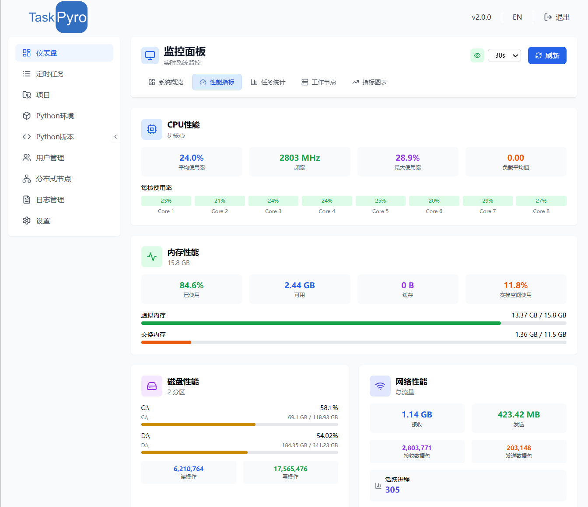
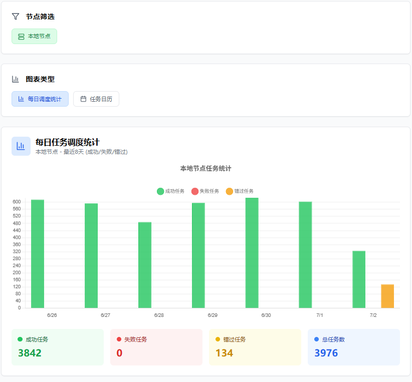

# 企业级监控仪表盘

TaskPyro 专业版提供了全面的监控功能，通过直观的仪表盘界面实时展示整个平台的运行状态、性能指标和任务执行情况。

（不想看字可以直接看图，可以实际部署体验一下）

# 系统概览

系统概览界面是TaskPyro专业版的核心监控面板，提供了整个分布式集群的全局视图和关键指标展示。

## 核心统计卡片

界面顶部展示了四个关键指标卡片：

- **总任务数**：系统中配置的所有任务总数
- **总项目数**：当前创建的项目总数
- **总活跃任务**：定时的任务数
- **虚拟环境数**：已创建的Python虚拟环境数量

## 集群状态监控

### 节点状态概览
- **在线节点数**：当前在线的工作节点数量
- **节点健康状态**：各节点的运行状态和健康度
- **节点连接状态**：实时显示节点连接情况

### 系统运行状态
- **系统运行时间**：主控节点的持续运行时长
- **集群整体健康度**：基于各项指标综合评估的集群状态
- **服务可用性**：核心服务的可用性状态

# 性能指标

性能指标界面提供了系统核心性能数据的实时监控和可视化展示，帮助管理员全面了解系统运行状况。

## 系统资源监控

### CPU性能监控
- **CPU使用率**：实时显示当前CPU使用百分比
- **CPU负载**：展示系统负载情况和趋势
- **多核心监控**：分别显示各CPU核心的使用情况
- **负载历史**：提供CPU使用率的历史趋势图表

### 内存使用监控
- **内存使用率**：显示已使用内存与总内存的比例
- **内存分布**：展示系统内存、缓存、缓冲区的使用情况
- **内存趋势**：提供内存使用的时间序列图表
- **内存告警**：当内存使用率超过阈值时提供告警提示

### 磁盘存储监控
- **磁盘使用率**：显示各分区的存储使用情况
- **磁盘I/O**：监控磁盘读写性能指标
- **存储趋势**：展示磁盘使用量的变化趋势
- **存储告警**：磁盘空间不足时的告警机制

### 网络性能监控
- **网络流量**：实时监控网络入站和出站流量
- **网络延迟**：显示网络连接的延迟情况
- **连接状态**：监控网络连接数和连接质量
- **带宽使用**：展示网络带宽的使用情况

## 性能图表展示

### 实时性能图表
- **多指标综合图表**：在同一界面展示CPU、内存、磁盘、网络等多项指标
- **时间序列图表**：提供可配置时间范围的性能趋势图
- **对比分析图表**：支持不同时间段的性能对比分析

### 性能统计分析
- **峰值统计**：记录和展示各项性能指标的峰值情况
- **平均值分析**：计算和显示指定时间段内的平均性能水平
- **异常检测**：自动识别和标记异常的性能波动

# 任务统计

任务统计界面提供了全面的任务执行数据分析和可视化展示，帮助用户深入了解系统的任务执行情况和性能表现。

## 任务执行概览

### 核心执行指标
- **总执行次数**：系统中所有任务的累计执行次数
- **成功执行次数**：成功完成的任务执行次数
- **失败执行次数**：执行失败的任务次数统计
- **执行成功率**：成功执行次数占总执行次数的百分比
- **平均执行时长**：所有任务的平均执行时间

### 实时任务状态
- **运行中任务**：当前正在执行的任务数量
- **等待执行**：排队等待执行的任务数量
- **已暂停任务**：被用户主动暂停的任务数量
- **调度中任务**：正在进行调度分配的任务数量

## 任务执行趋势

### 时间维度分析
- **实时趋势**：最近24小时内的任务执行趋势图
- **日度趋势**：按天统计的任务执行情况
- **月度趋势**：按月统计的任务执行总量

### 执行质量分析
- **成功率趋势**：任务执行成功率的时间变化图表
- **失败率分析**：任务失败率及失败原因统计
- **执行时长分布**：任务执行时长的分布情况

## 分布式执行统计

### 节点执行分布
- **节点负载分布**：各节点的任务执行负载情况
- **节点性能对比**：不同节点的执行效率对比
- **节点可用性**：各节点的在线时间和可用性统计
- **负载均衡效果**：任务在各节点间的分布均衡度

### 项目维度统计
- **项目执行排行**：按项目统计的任务执行次数排行
- **项目成功率对比**：不同项目的任务执行成功率对比
- **项目资源消耗**：各项目的系统资源使用情况
- **项目执行趋势**：各项目任务执行量的时间趋势

# 工作节点

工作节点界面提供了对分布式集群中所有节点的统一管理和实时监控，支持主控节点和工作节点的全面管理。

## 节点概览

### 节点基本信息
- **节点标识**：显示节点的唯一名称和ID
- **节点类型**：区分主控节点和工作节点
- **连接状态**：实时显示节点的在线/离线状态
- **系统信息**：展示操作系统类型、架构和Python版本
- **网络信息**：显示节点IP地址和端口信息

### 节点运行状态
- **运行时长**：节点持续运行的时间统计
- **最后心跳**：节点最后一次状态报告的时间
- **服务状态**：TaskPyro服务的运行状态
- **连接质量**：网络连接的稳定性和延迟情况

## 节点性能监控

### 实时资源监控
- **CPU使用率**：实时显示各节点的CPU使用情况
- **内存使用率**：监控节点内存使用状态和趋势
- **磁盘使用率**：显示节点存储空间使用情况
- **网络流量**：监控节点网络入站和出站流量

### 任务执行监控
- **当前任务数**：显示各节点正在执行的任务数量
- **任务队列**：展示等待执行的任务队列长度
- **执行历史**：统计节点的历史任务执行情况
- **性能指标**：显示任务执行效率和成功率

# 指标图表

指标图表界面提供了强大的数据可视化和分析功能，通过多种图表类型直观展示系统性能指标和任务执行趋势。

## 任务执行分析图表

### 任务执行统计
- **执行量趋势图**：显示任务执行次数的时间分布
- **成功率分析图**：展示任务执行成功率的变化趋势
- **执行时长分布**：任务执行时间的统计分布图
- **任务类型分布**：不同类型任务的执行比例饼图

## 交互式图表功能

### 图表交互操作
- **时间范围选择**：支持灵活的时间范围选择和缩放
- **数据钻取**：支持从概览图表钻取到详细数据
- **多维度筛选**：按节点、项目、任务类型等维度筛选数据
- **实时刷新**：支持图表数据的实时更新和刷新