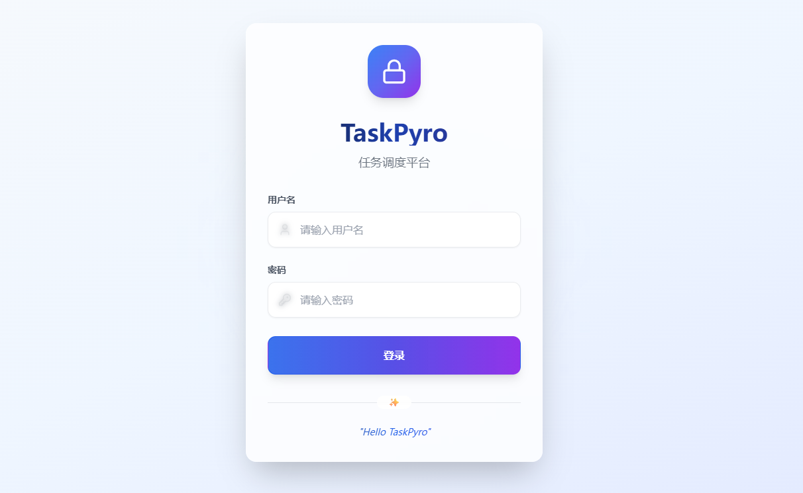
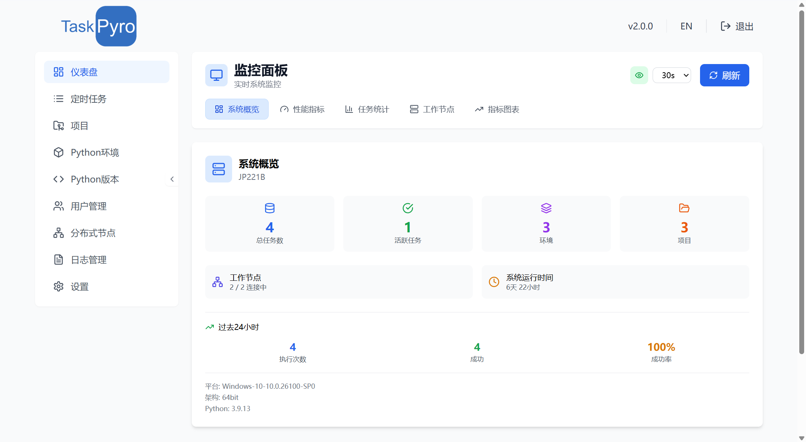

## TaskPyro 专业版是什么？

TaskPyro 专业版是一个功能强大的分布式 Python 任务调度平台，在标准版基础上提供了企业级的分布式架构、高级监控和权限管理功能。它不仅支持单机部署，更能够构建跨平台的分布式任务调度集群，为企业级应用提供高可用、高性能的任务管理解决方案。

账号： admin
密码： admin123

## 开发背景

在当今数字化时代，自动化数据采集和处理变得越来越重要。然而，现有的任务调度解决方案要么过于复杂，要么缺乏针对 Python 环境的特定优化。特别是许多用户的代码需要在 Windows 环境下才能更好地运行（如使用特定的 Windows API、COM 组件或依赖 Windows 特有的软件或一些浏览器自动化爬虫代码），但却缺乏合适的系统来进行统一的管理、调度和监控。TaskPyro 正是为了解决这些痛点而诞生的，旨在为 Python 开发者提供一个简单、高效、可靠的跨平台任务调度平台。

## 适用人群

TaskPyro 企业版特别适合以下用户群体：

- 🏢 **大型企业**：需要跨机器、跨地域的分布式任务调度管理
- 🔍 **数据工程师**：需要在多台服务器上执行大规模数据采集和处理任务
- 🕷️ **爬虫开发者**：需要管理分布在不同节点的爬虫任务集群
- 📊 **数据分析师**：需要在多个计算节点上并行执行数据分析任务
- 🛠️ **系统运维人员**：需要统一管理多台服务器的定时维护任务
- 👥 **开发团队**：需要多用户协作和权限管理的任务调度平台
- 🌐 **混合环境**：需要同时管理 Windows 和 Linux 服务器的任务调度

## 使用流程
- 部署主控节点（Docker）
- 配置分布式工作节点（Windows/Linux）（可选，不配置也可以直接本机部署任务）
- 配置Python环境和版本
- 创建项目并分发到工作节点
- 配置用户权限和访问控制
- 配置消息通知和监控告警
- 创建本机/分布式定时任务

## 核心功能

TaskPyro 企业版提供了一系列企业级功能，帮助您构建高可用的分布式任务调度系统：

- 🌐 **分布式架构**
  - 支持 Windows 和 Linux 混合节点部署
  - 无需 Docker 环境的轻量级工作节点
  - 通过 Docker 一键安装主控节点统一管理所有分布式节点
  - 跨平台任务调度和执行

- 📊 **企业级监控**
  - 系统概览：实时展示集群整体状态
  - 性能指标：CPU、内存、磁盘使用率监控
  - 任务统计：成功率、执行时间、错误分析
  - 工作节点：节点状态、资源使用、连接状态
  - 指标图表：历史趋势分析和性能报表

- 📅 **任务调度**
  - 支持 Cron 表达式定时调度
  - 自主选择节点和任务分发
  - 支持任务依赖关系配置
  - 支持一次性和周期性任务

- 🔧 **环境管理**
  - 跨节点 Python 虚拟环境管理
  - 环境配置自动同步和分发
  - 主机支持多版本 Python 环境
  - 依赖包统一管理和安装
  - 环境隔离，避免依赖冲突

- 📁 **项目管理与代码分发**
  - 项目文件自动分发到工作节点
  - 在线代码浏览和编辑功能
  - 支持多种项目类型和框架
  - 代码同步状态实时监控

- 👥 **用户权限管理**
  - 多用户角色和权限控制
  - 页面访问权限精细化配置
  - 管理员可分配用户访问范围

- 🔐 **环境变量管理**
  - 集中化环境变量配置
  - 敏感信息加密存储
  - 支持动态配置更新
  - 账号密码等敏感信息安全管理

- 🕷️ **爬虫框架支持**
  - 支持 Scrapy 等主流爬虫框架
  - 支持 Selenium、Playwright、DrissionPage 等浏览器自动化工具
  - 提供完整的框架运行环境配置
  - 内置 Node.js 环境，支持 JS 逆向
  - 支持 PyExecJS 等常用逆向库
  - 支持 Python 与 JS 代码无缝集成

- 📈 **高级监控与告警**
  - 实时任务状态监控
  - 详细的执行日志记录
  - 任务执行统计分析
  - 支持钉钉、飞书、企业微信通知
  - 异常告警和执行结果推送
  - 性能瓶颈分析和优化建议

- 💼 **企业级特性**
  - 高可用架构设计
  - 集群扩展和缩容
  - 详细的使用文档和技术支持
  - 1.x 版本无缝升级支持

