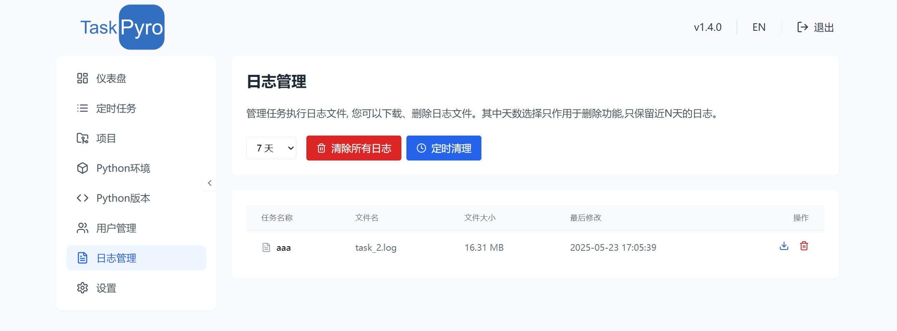

# 日志管理

TaskPyro提供了完善的日志管理功能，让您能够方便地查看、下载和管理任务执行过程中产生的日志文件。

## 日志概述

在TaskPyro中，系统会自动为每个任务执行过程生成详细的日志文件，记录任务的执行情况、输出信息和可能出现的错误。这些日志对于：

- 监控任务执行状态
- 排查任务执行问题
- 分析任务执行结果
- 优化任务执行效率

都提供了重要的参考信息。

## 日志列表

日志管理界面展示了系统中所有任务产生的日志文件列表，包含以下信息：

- 任务名称：生成日志的任务名称
- 文件名：日志文件的名称，通常包含任务ID和时间戳
- 文件大小：日志文件的大小
- 创建时间：日志文件的创建时间
- 操作：可对日志执行的操作（下载、删除）




## 日志操作

对于每个日志文件，您可以执行以下操作：

### 下载日志

点击下载图标，可以将日志文件下载到本地进行详细分析或存档。

### 删除日志

点击删除图标，可以删除不再需要的日志文件，释放存储空间。


## 日志自动清理

为了避免日志文件占用过多存储空间，TaskPyro提供了自动清理功能：

1. 在日志管理页面，点击"定时清理"按钮
2. 设置自动清理规则，例如：
   - 保留最近7天的日志
   - 保留最近30天的日志
   - 仅保留最近执行的日志

系统会根据设置的规则，自动删除符合条件的过期日志文件。

## 日志文件格式

TaskPyro生成的日志文件采用标准的文本格式，包含以下信息：

- 时间戳：记录每条日志的精确时间
- 日志级别：如INFO、WARNING、ERROR等，表示日志的重要程度
- 模块名称：生成日志的程序模块
- 日志内容：详细的执行信息、输出结果或错误信息

示例日志内容：

```
2025-05-23 16:45:32 [INFO] task_runner: Task 'data_collection' started
2025-05-23 16:45:33 [INFO] data_collector: Connecting to data source
2025-05-23 16:45:35 [INFO] data_collector: Successfully retrieved 256 records
2025-05-23 16:45:36 [WARNING] data_processor: Found 3 records with missing values
2025-05-23 16:45:38 [INFO] data_processor: Data processing completed
2025-05-23 16:45:39 [INFO] task_runner: Task 'data_collection' completed successfully
```

## 最佳实践

为了更有效地使用TaskPyro的日志管理功能，建议：

1. **定期检查日志**：定期查看任务日志，及时清理过大的日志文件
2. **设置自动清理**：配置适当的日志自动清理规则，避免占用过多存储空间
3. **保存重要日志**：对于重要任务的关键执行记录，及时下载并存档

通过合理利用TaskPyro的日志管理功能，您可以更高效地监控和管理Python任务的执行情况，提高自动化流程的可靠性和可维护性。
