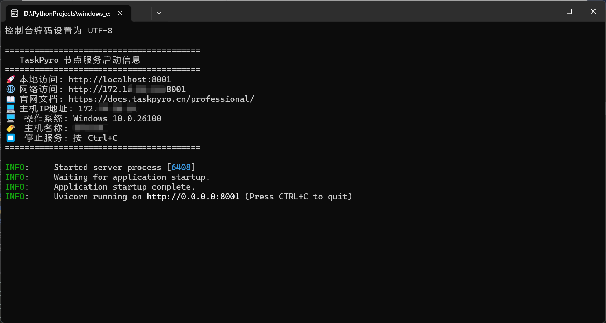

# 分布式节点管理

TaskPyro专业版支持分布式架构，通过主控节点和工作节点的分离部署，实现跨平台任务调度和高可用性。本文档将详细介绍如何创建、配置和管理分布式节点。

## 节点架构概述


### 主控节点（Master Node）
- **功能**：负责任务调度、用户界面、数据存储和节点管理
- **部署**：通常部署在性能较好的服务器上
- **数量**：一个集群只有一个主控节点
- **职责**：
  - 任务分发和调度
  - 节点状态监控
  - 用户权限管理
  - 数据持久化存储

### 工作节点（Worker Node）
- **功能**：执行特定的任务和爬虫脚本
- **部署**：需部署在不同操作系统的服务器上。如Windows上
- **数量**：支持多个工作节点
- **职责**：
  - 任务执行
  - 资源监控上报
  - 环境管理
  - 日志收集

## 节点创建步骤

### 1. 准备工作

在创建节点之前，请确保：

- 主控节点已正常运行
- 工作节点服务器已安装Python环境
- 网络连接正常，节点间可以相互通信
- 防火墙已开放必要端口（默认8001）

### 2. 添加节点

#### 通过Web界面添加

1. **登录主控节点**
   - 访问主控节点的Web界面
   - 使用管理员账户登录

2. **进入节点管理**
   - 点击左侧菜单「分布式节点」
   - 点击右上角「+ 添加节点」按钮

3. **填写节点信息**
   ```
   节点IP：172.168.1.100
   节点端口：8001
   节点名称：Windows节点-1
   节点描述：用于执行Windows相关任务
   ```

4. **验证连接**
   - 系统会自动验证节点连接性
   - 确保目标服务器已启动TaskPyro工作节点服务


### 3. 工作节点部署

#### Windows系统部署

### 前置条件
- Windows 10/11 或 Windows Server 2016 及以上版本
- Python 3.8 或更高版本
- 网络连接到主控节点

### 安装步骤

#### 1. 下载工作节点程序

gitub
```bash
git clone https://github.com/taskPyroer/taskpyro.git
```
```bash
# 进入到v2版本的文件
cd v2/windows-server

```

gitee

```bash
git clone https://gitee.com/taskPyroer/taskpyrodocker.git
```
```bash
# 进入到v2版本的文件
cd v2/windows-server
```

#### 2. 配置端口

修改 `.env` 文件：

```
SERVER_PORT=8001
PYTHON_EXECUTABLE=D:\Programs\Python\Python311\python.exe
```
修改SERVER_PORT为指定的端口号，注意需要将Windows的端口防火墙打开，若不清楚可上网查询Windows下如何开放指定端口

PYTHON_EXECUTABLE=Python解释器路径配置，如果不设置，将使用系统默认的exe的python版本3.9+

#### 3. 启动工作节点

双击运行windows_executor.exe文件，即可直接启动；如下：




## 节点配置管理

### 节点状态监控

在主控节点的「分布式节点」页面，可以实时查看：

- **连接状态**：在线/离线
- **系统信息**：操作系统、CPU、内存
- **资源使用**：CPU使用率、内存使用率、磁盘空间
- **任务统计**：运行中任务数、历史任务数
- **Python环境**：已安装的Python版本和虚拟环境


### 故障排查

#### 常见问题

1. **节点连接失败**
   ```bash
   # 检查网络连通性
   ping master-node-ip
   telnet master-node-ip 8000
   
   # 检查防火墙设置
   netstat -an | grep 8001
   ```

windows节点的端口开放参考网站的教程：https://blog.csdn.net/idjdkdjsj/article/details/148389687