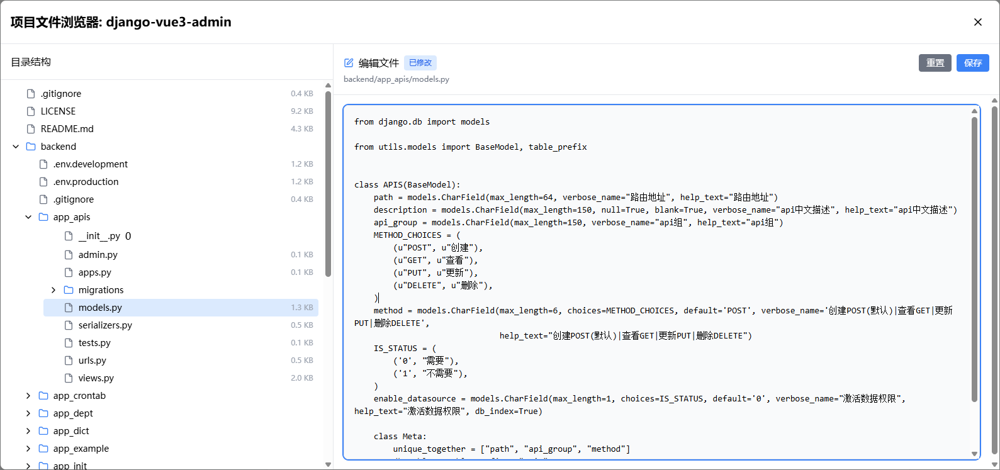

## 项目管理功能

TaskPyro 企业版提供了强大的项目管理界面，支持项目的创建、编辑、文件分发、代码浏览和在线编辑等功能。本文将详细介绍企业版项目管理的各项功能。

## 企业版项目管理特性

### 文件管理
- **自动文件分发**：项目可以选择本机上传，或者选择到指定的工作节点
- **增量同步**：支持项目文件的增量更新和同步
- **节点选择**：可指定项目分发到特定的工作节点

### 代码浏览与编辑
- **在线代码浏览**：支持浏览项目中的所有代码文件
- **语法高亮**：支持 Python、JavaScript、HTML、CSS 等多种语言
- **文件树导航**：提供直观的文件目录结构
- **在线编辑器**：内置强大的代码编辑器，支持实时编辑
- **代码搜索**：支持在项目中搜索特定代码片段

## 项目列表

在企业版项目管理界面，您可以查看已创建的项目列表。每个项目都包含以下信息：

### 项目基本信息
- **项目名称**：项目的唯一标识
- **项目描述**：项目的详细说明
- **节点信息**：项目的节点分布信息
- **创建时间**：项目的创建日期
- **最后更新**：项目文件的最后修改时间
- **项目标签**：用于分类和筛选的标签

### 快速操作
- **代码浏览**：快速浏览项目代码
- **在线编辑**：直接编辑项目文件
- **节点管理**：管理项目在各节点的部署
- **同步操作**：手动修改项目代码可以同步到原节点

## 创建项目

在项目管理界面，您可以通过点击"新建项目"按钮来创建新的项目。新建项目界面如下：

::: tip 企业版提示
企业版支持不同节点上传不同的项目，以适应不同操作系统的Python项目。
:::

### 工作路径

工作路径是项目文件的执行路径，系统会根据上传的ZIP文件结构自动推荐合适的工作路径：

- 单文件情况：如果ZIP解压后只有一个Python文件，工作路径默认设置为 `/`
- 文件夹情况：如果ZIP解压后包含项目文件夹（如 `Demo` 文件夹），且Python文件位于该文件夹中，则工作路径会设置为 `/Demo`，**即工作路径为项目文件夹名称**
- GIT仓库情况：如果选择Git仓库方式导入项目，工作路径默认设置为 `/`
- 如果上述还是看不懂，你就把文件上传后，点击浏览项目文件，查看你就懂后面的任务命令行怎么写了

### 项目描述

- 可以添加项目的详细说明
- 支持描述项目的功能、用途、注意事项等信息

### 项目标签

- 支持为项目添加多个标签
- 标签可用于项目分类和快速筛选
- 在输入框中输入标签名称，点击"添加"按钮即可创建新标签

#### ZIP上传

- 支持上传ZIP格式的压缩文件
- ZIP文件应包含完整的项目代码和相关资源
- 可以通过拖拽或点击选择文件的方式上传

#### Git仓库

- 支持从Git仓库拉取代码
- 需要提供完整的Git仓库地址（HTTPS格式）
- 可以选择指定的分支（默认为main分支）
- 支持私有仓库认证（可选填写用户名和密码）

## 代码浏览与在线编辑

### 代码浏览功能

企业版提供了代码浏览功能：

#### 文件树导航
- **目录结构**：以树形结构显示项目的完整目录
- **文件类型图标**：不同文件类型显示对应的图标
- **快速搜索**：支持文件名的快速搜索和定位
- **文件统计**：显示文件大小、修改时间等信息

#### 代码查看
- **语法高亮**：支持 Python、JavaScript、HTML、CSS、JSON、YAML 等多种语言
- **代码折叠**：支持代码块的折叠和展开
- **行号显示**：显示代码行号，便于定位
- **代码搜索**：支持在文件内搜索特定代码片段

#### 文件预览
- **文档预览**：支持 Markdown、TXT 等文档的格式化显示
- **配置文件**：支持 JSON、YAML、INI 等配置文件的结构化显示

### 在线编辑功能

企业版内置了强大的在线代码编辑器;支持无限次的撤销和重做操作

### 项目同步与分发

当项目创建或更新后，系统会自动将项目文件分发到指定的工作节点：