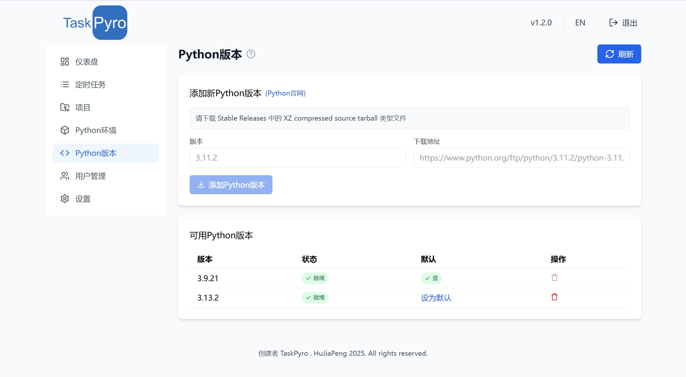

# Python版本管理

## 功能介绍

TaskPyro提供了强大的Python版本管理功能，支持多个Python版本的并存和切换。通过简单的操作，您可以轻松地下载、安装和管理不同版本的Python环境，为不同的爬虫项目提供独立的运行环境。

## 添加Python版本

1. 从官网（https://www.python.org/downloads/source/） 下载所需要的版本，请下载 Stable Releases 中的 XZ compressed source tarball 类型文件，即.tar.xz格式
2. 填写版本名称、下载地址
3. 点击「添加Python版本」按钮
3. 系统会自动从Python官网下载对应的安装包
4. 下载完成后，系统会自动解压并完成安装,整个过程耗时会较长，请耐心等待

::: tip 提示
- 仅支持下载Python官方发布的Stable版本
- 下载源为Python官方网站，请确保网络连接正常
- 选择.tar.xz格式的压缩包，下载速度更快
- 目前只支持本机选择Python版本，分机部署的Python版本可自行选择安装
:::

## 可用的Python版本

以下是一些可供下载的Python稳定版本：

### 最新版本

| 版本号 | 发布日期 | 下载地址 |
| --- | --- | --- |
| Python 3.13.3 | 2025年4月8日 | https://www.python.org/ftp/python/3.13.3/Python-3.13.3.tar.xz |
| Python 3.12.10 | 2025年4月8日 | https://www.python.org/ftp/python/3.12.10/Python-3.12.10.tar.xz |
| Python 3.11.12 | 2025年4月8日 | https://www.python.org/ftp/python/3.11.12/Python-3.11.12.tar.xz |
| Python 3.10.17 | 2025年4月8日 | https://www.python.org/ftp/python/3.10.17/Python-3.10.17.tar.xz |
| Python 3.9.22 | 2025年4月8日 | https://www.python.org/ftp/python/3.9.22/Python-3.9.22.tar.xz |

### 历史版本

| 版本号 | 发布日期 | 下载地址 |
| --- | --- | --- |
| Python 3.13.2 | 2025年2月4日 | https://www.python.org/ftp/python/3.13.2/Python-3.13.2.tar.xz |
| Python 3.12.9 | 2025年2月4日 | https://www.python.org/ftp/python/3.12.9/Python-3.12.9.tar.xz |
| Python 3.12.8 | 2024年12月3日 | https://www.python.org/ftp/python/3.12.8/Python-3.12.8.tar.xz |
| Python 3.13.1 | 2024年12月3日 | https://www.python.org/ftp/python/3.13.1/Python-3.13.1.tar.xz |
| Python 3.11.11 | 2024年12月3日 | https://www.python.org/ftp/python/3.11.11/Python-3.11.11.tar.xz |
| Python 3.10.16 | 2024年12月3日 | https://www.python.org/ftp/python/3.10.16/Python-3.10.16.tar.xz |
| Python 3.9.21 | 2024年12月3日 | https://www.python.org/ftp/python/3.9.21/Python-3.9.21.tar.xz |

## 版本管理

在Python版本列表中，您可以：

- 查看已安装的Python版本
- 查看每个版本的安装状态
- 设置默认Python版本
- 删除不需要的Python版本

::: warning 注意
- 删除Python版本前，请确保没有项目正在使用该版本
- 默认Python版本不能被删除
- 建议保留至少一个Python版本
:::

## 在Python虚拟环境中使用

1. 创建新虚拟环境时，可以选择指定的Python版本

## 最佳实践

1. 为不同的项目选择合适的Python版本
2. 定期清理不再使用的Python版本
3. 保持系统中的Python版本精简，避免占用过多存储空间
4. 在添加新版本前，先确认项目的Python版本兼容性

## 常见问题

### Q: 如何选择合适的Python版本？

A: 建议根据项目的实际需求选择Python版本：
- 如果使用较新的Python特性，选择最新的稳定版本
- 如果项目依赖较老的库，选择相对较旧的版本
- 如果不确定，建议使用Python 3.8或更高版本

### Q: 更改Python版本后项目无法运行怎么办？

A: 请检查以下几点：
1. 确认项目的依赖包是否兼容新版本
2. 检查是否有使用了版本特定的语法
3. 尝试重新安装项目依赖
4. 如果问题仍然存在，建议回退到之前的Python版本

### Q: 分机是否支持切换版本？

1. 分机部署的微服务Python版本，是用户自主根据情况安装的Python版本