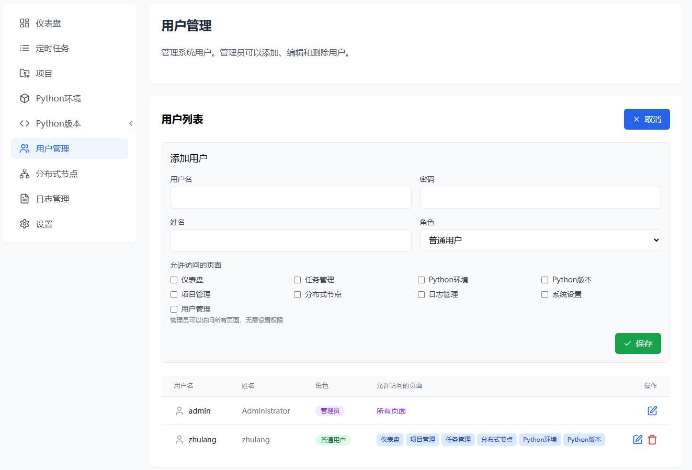
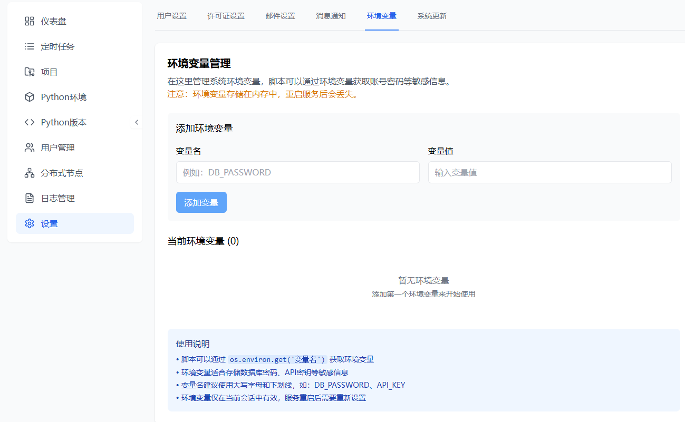
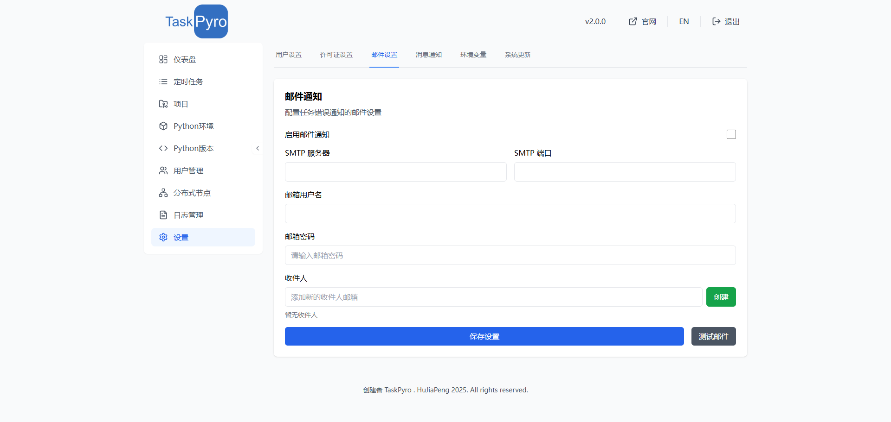
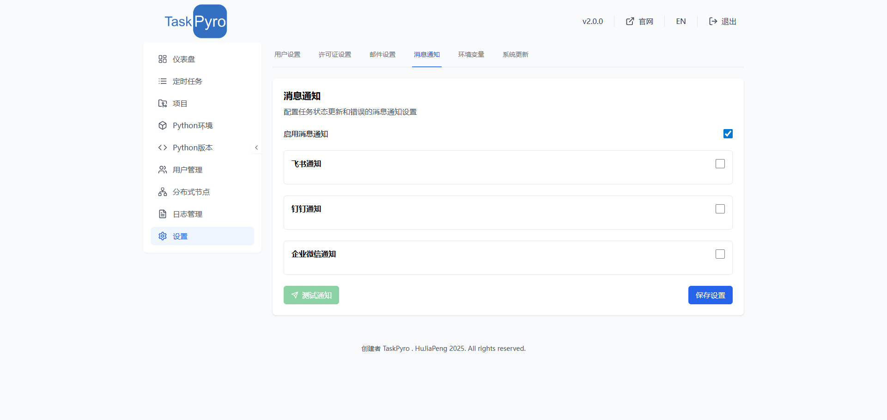

# 专业版系统设置

TaskPyro 专业版提供了全面的系统设置功能，包括用户管理、权限控制、环境变量管理、许可证管理、邮件通知等企业级功能。

## 用户管理

专业版提供了完整的用户管理功能，支持多用户协作和精细化权限控制。

### 用户账户管理

系统默认的管理员账户信息如下：

- 用户名：admin
- 默认密码：admin123

为了系统安全，建议您在首次登录后立即修改默认密码。

### 用户创建与管理

管理员可以创建和管理多个用户账户：


### 页面访问权限设置

管理员可以为每个用户分配具体的页面访问权限：




## 环境变量管理

专业版新增了环境变量管理功能，允许管理员在系统设置中配置全局环境变量，脚本可以通过环境变量获取账号密码等敏感信息，提高系统安全性。



### 脚本中使用环境变量

#### Python 脚本示例

```python
import os

# 获取数据库连接信息
db_host = os.getenv('DB_HOST', 'localhost')
db_user = os.getenv('DB_USER')
db_password = os.getenv('DB_PASSWORD')
db_name = os.getenv('DB_NAME')

# 获取API密钥
api_key = os.getenv('API_KEY')
api_secret = os.getenv('API_SECRET')

# 获取配置信息
log_level = os.getenv('LOG_LEVEL', 'INFO')
max_retry = int(os.getenv('MAX_RETRY', '3'))
```

## 许可证设置

专业版许可证管理提供了完整的许可证生命周期管理功能，支持多种许可证类型和灵活的授权模式。


### 许可证管理功能

许可证设置页面显示了您当前的许可证状态和使用限制。免费版用户可以使用以下功能：

- 创建最多 5 个定时任务
- 创建最多 2 个项目
- 创建最多 2 个虚拟环境

如需突破以上限制，您可以[购买许可证](../price/README.md)以获得无限制使用权限。点击"激活"按钮，输入有效的许可证密钥即可激活高级功能。如需购买许可证，请订阅。


## 邮件设置

专业版邮件设置提供了全面的邮件通知功能，支持多种通知场景和灵活的通知规则配置。

### 邮件服务配置

#### SMTP服务器设置

配置邮件通知需要设置以下基本信息：


邮件设置功能允许您配置系统的邮件通知功能。当启用邮件通知后，系统会在定时任务执行出错时自动发送警报邮件。

配置邮件通知需要设置以下信息：

1. SMTP服务器地址
2. SMTP端口
3. 邮箱用户名
4. 邮箱密码
5. 启用通知
完成上面配置后，点击保存按钮即可。



#### 信息通知功能

1. **第三方集成**
   - 钉钉机器人
   - 企业微信
   - 飞书

