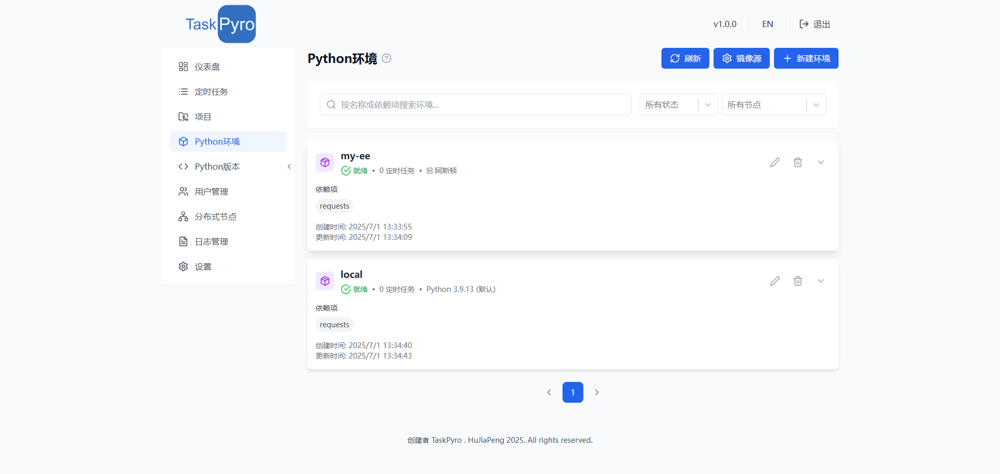

# Python虚拟环境管理

TaskPyro 专业版提供了强大而灵活的Python虚拟环境管理功能，支持跨节点的环境创建、同步和管理。通过直观的Web界面，您可以轻松在多个工作节点上创建、编辑和管理虚拟环境，为本机或分布式任务提供统一的运行环境。




## 分布式环境架构

### 环境分发模式
- **主控节点管理**：在主控节点统一管理所有虚拟环境配置，当然也支持在本机安装
- **配置同步**：环境配置信息在创建环境的时候可不选节点即默认本地节点，也可以选择分节点
- **状态监控**：实时监控各节点环境的创建状态

### 节点兼容性
- **Windows节点**：支持在Windows工作节点创建虚拟环境
- **Linux节点**：支持在Linux工作节点创建虚拟环境
- **Python版本管理**：只支持本机节点，不支持分机节点的选择，分机的Python版本自主在安装微服务的时候选择即可
- **环境隔离**：确保不同节点间环境的完全隔离

### 智能镜像源管理

- 🌐 **多源支持**：内置多个常用PyPI镜像源，包括：
  - 官方PyPI源
  - 阿里云镜像源
  - 清华大学镜像源
  - 中国科技大学镜像源
  - 华为云镜像源
  - 腾讯云镜像源
- ✏️ **自定义配置**：支持添加、编辑和删除镜像源
- 🔄 **智能切换**：根据节点地理位置自动选择最优镜像源
- 🌍 **节点适配**：为不同地区的节点配置不同的镜像源
- 📈 **速度监控**：监控各镜像源的下载速度，自动优化选择

### 环境同步与版本控制

- 🔄 **配置同步**：环境配置在主控节点和工作节点间自动同步
- 📦 **依赖同步**：支持依赖包列表的增量同步
- 🏷️ **版本标签**：为环境创建版本标签，便于管理和回滚
- 📊 **差异对比**：对比不同节点间环境的差异


## 专业版分布式环境的优势

### 1. 分布式资源效率

- 🚀 **跨节点资源优化**：在多个节点间智能分配环境创建任务，避免单点资源瓶颈
- 💾 **节点存储优化**：根据节点存储容量智能选择环境创建位置
- 🔄 **负载均衡**：根据节点负载情况动态调整环境分布

### 2. 企业级管理

- 🎯 **集中管理**：统一的Web界面管理所有节点的虚拟环境
- 🔄 **即时同步**：环境配置更新后自动同步到所有相关节点
- 📊 **全局监控**：实时监控所有节点的环境状态和资源使用情况


## 环境创建流程

### 1. 环境规划

- **需求分析**：分析任务对环境的具体需求
- **节点选择**：根据任务特性选择合适的工作节点（本地节点、分机节点）
- **资源评估**：评估所需的计算和存储资源
- **依赖分析**：分析项目的依赖包和版本要求

### 2. 创建配置

- **基本信息**：设置环境名称、描述和标签
- **Python版本**：为不同节点选择合适的Python版本
- **依赖包列表**：配置需要安装的依赖包
- **节点分布**：选择环境要创建的目标节点
- **同步策略**：设置环境的同步和更新策略


### 3. 手动干预处理环境创建

对于需要手动处理的特殊情况，专业版提供了多种工具：

**Windows/Linux节点处理：**
1. 通过远程桌面连接到Windows工作节点
2. 导航到虚拟环境目录：
   ```cmd
   cd 安装目录\virtual_environments\<your-env-name>
   ```
3. 激活虚拟环境并手动安装包：
   ```cmd
   pip install <package-name>
   ```


**主控节点处理：**
1. 使用Docker命令进入主控容器：
   ```bash
   docker exec -it <container_id> /bin/bash
   ```
2. 导航到虚拟环境目录：
   ```bash
   cd /static/taskProjectVenvs/<your-env-name>
   ```
3. 在虚拟环境中直接安装或管理包

### 网络连接问题处理

#### 1. 镜像源切换
- **自动检测**：系统自动检测最快的镜像源
- **手动切换**：管理员可手动为特定节点配置镜像源
- **私有镜像源**：支持配置企业内部的私有镜像源

#### 2. 代理配置
- **HTTP代理**：支持为节点配置HTTP代理
- **HTTPS代理**：支持HTTPS代理配置
- **认证代理**：支持需要认证的代理服务器

#### 3. 离线安装
- **离线包管理**：支持上传离线安装包
- **本地缓存**：利用本地缓存减少网络依赖
- **包分发**：将安装包分发到各个工作节点

### 权限问题处理

#### 1. 节点权限配置
- **用户权限**：确保工作节点有足够的用户权限
- **目录权限**：检查虚拟环境目录的读写权限
- **系统权限**：某些包可能需要系统级权限

#### 2. 安全策略调整
- **防火墙配置**：调整防火墙规则允许包下载
- **安全软件**：配置安全软件白名单

